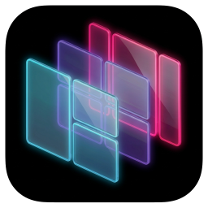
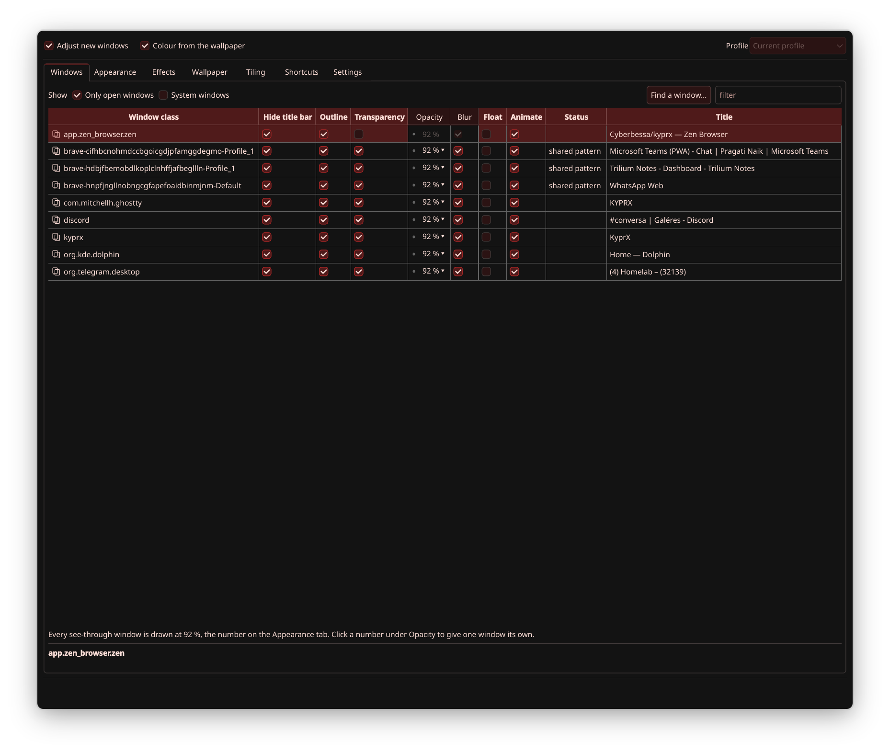
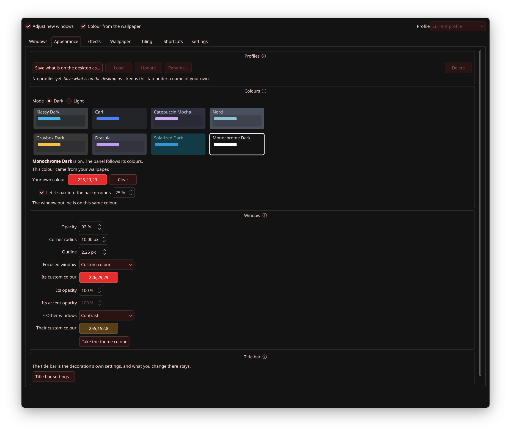
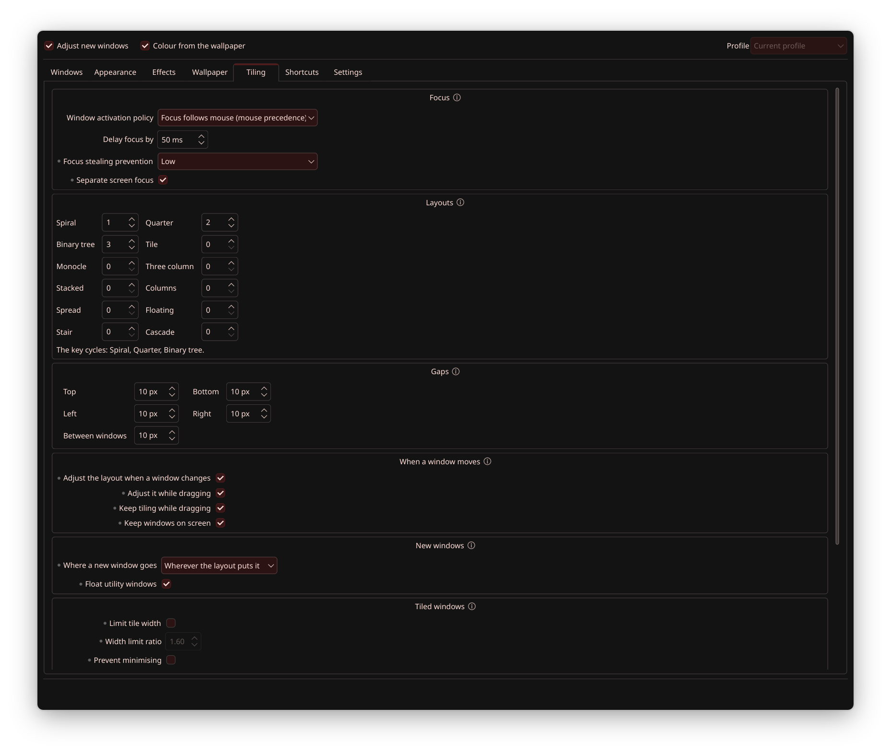
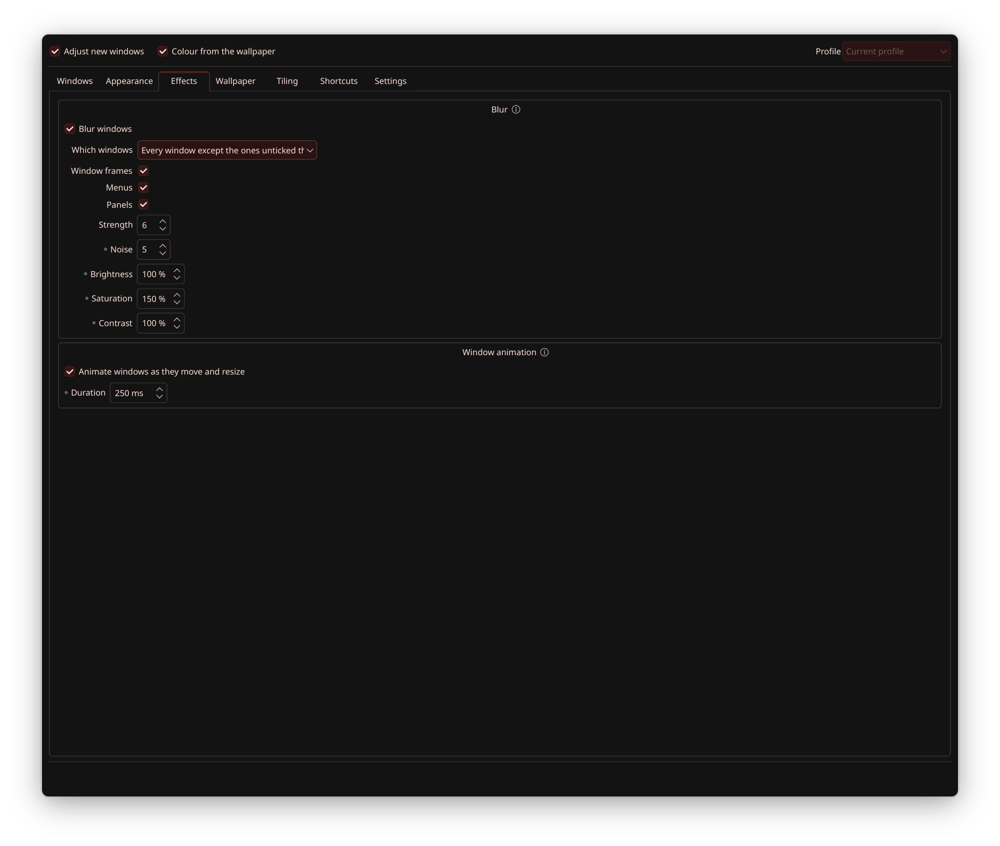
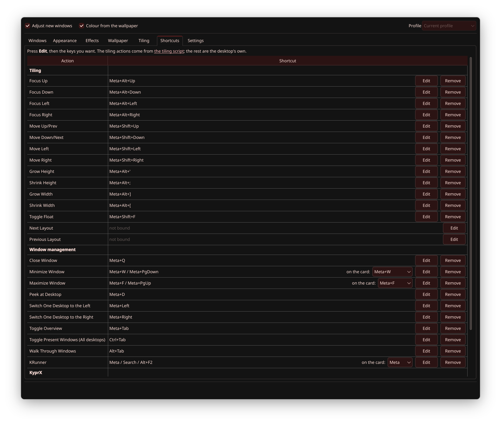
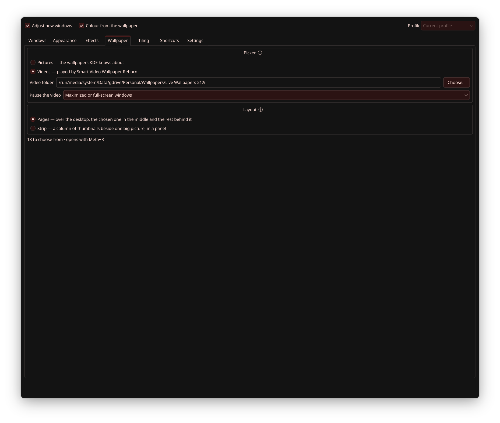
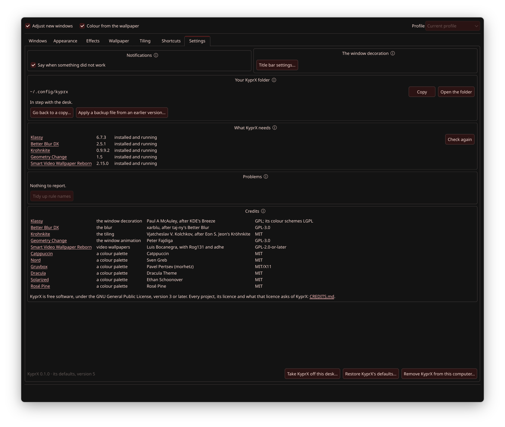

<p align="center">
  <picture>
    <source media="(prefers-color-scheme: dark)" srcset="share/icons/kyprx-mark.png">
    
  </picture>
</p>

<h1 align="center">KyprX — KDE-Native Hyprland Experience</h1>

<p align="center">
  The clean, tiled, title-bar-free look of Hyprland, built into KDE Plasma 6 —<br>
  and one window to shape all of it.
</p>

<p align="center">
  <a href="https://github.com/cyberbessa/kyprx/releases"></a>
  <a href="https://copr.fedorainfracloud.org/coprs/cyberbessa/kyprx/"></a>
  <a href="https://aur.archlinux.org/packages/kyprx"></a>
  
  
  <a href="LICENSE"></a>
  <a href="https://ko-fi.com/cyberbessa"></a>
</p>

<p align="center">
  <a href="#install"><b>Install</b></a> ·
  <a href="#why-youll-like-it"><b>Features</b></a> ·
  <a href="#see-it-move"><b>See it</b></a> ·
  <a href="#roadmap"><b>Roadmap</b></a> ·
  <a href="docs/user-guide/README.md"><b>User guide</b></a> ·
  <a href="https://ko-fi.com/cyberbessa"><b>Support KyprX</b></a>
</p>

<p align="center">
  
</p>

---

Hyprland looks stunning — but getting that look has always meant leaving KDE Plasma, and
everything Plasma does for you, behind. **KyprX brings the look to Plasma instead.** Windows open
tiled side by side, with no title bars, a slim accent outline, a touch of transparency and blur
behind them — while your apps, your settings and the rest of your desktop stay right where they
are.

**Native, not bolted on.** There is no second compositor, and nothing is replaced: KyprX sets up
KWin, KDE's own window manager, and the decoration, blur and tiling plugins it runs — and gathers
every one of their settings into a single window, where each change lands the moment you make it.

## Why you'll like it

- **Tiled from the first window.** Open an app and it takes its place in the layout: no dragging,
  no snapping. Tune the layouts, the gaps and the focus to taste, and move around from the
  keyboard.
- **No title bars, all the style.** Clean frames with an accent outline, transparency and blur —
  set once for everything, or app by app.
- **One window instead of five settings pages.** Decoration, blur, tiling, animations, shortcuts
  and colours, side by side. There is no Apply button: what you change is simply there.
- **A new look in one click.** Catppuccin, Nord, Gruvbox, Dracula, Solarized, Rosé Pine and
  Monochrome, dark and light — or the colour of your wallpaper, soaked into the whole desktop.
- **Profiles.** Keep a look under a name and bring it back in a second.
- **Wallpapers that move.** A picker for pictures and video wallpapers, one key away.
- **Every shortcut at a glance.** One key shows them all, and every key can be changed.
- **Made for dotfiles.** Your whole setup is a folder of readable files, `~/.config/kyprx/`. Keep
  it in git, carry it to another computer, and KyprX applies it by itself.
- **Safe to try.** A copy of your desktop is kept before every big change, stock KDE is one click
  away, and removing KyprX asks first and leaves nothing of its own behind.

## See it move

**The wallpaper picker.** Meta+R opens it over the desktop: the chosen wallpaper in the middle,
the rest leaning away on either side, and Enter puts it on. Pictures or videos.

<p align="center">
  
</p>

**Transparency, live.** One number sets how see-through every window is, and the windows follow
as the number changes.

<p align="center">
  
</p>

**Every shortcut at a glance.** Meta+/ shows them all, grouped, over whatever is on screen.

<p align="center">
  
</p>

## One window, tab by tab

<table>
  <tr>
    <td width="50%"><br><b>Windows</b> — every app on a row of its own: title bar, outline, transparency, blur, floating and animation.</td>
    <td width="50%"><br><b>Appearance</b> — profiles, colour presets, a colour of your own or the wallpaper's, and the windows' opacity, corners and outline.</td>
  </tr>
  <tr>
    <td><br><b>Tiling</b> — focus, the layouts the key cycles through, the gaps, and where a new window goes.</td>
    <td><br><b>Effects</b> — the blur behind windows, menus and panels, and the animation as windows move.</td>
  </tr>
  <tr>
    <td><br><b>Shortcuts</b> — the tiling keys and the desktop's own, each one yours to change.</td>
    <td><br><b>Wallpaper</b> — pictures or videos, the video folder, when a video pauses, and the picker's layout.</td>
  </tr>
  <tr>
    <td><br><b>Settings</b> — your KyprX folder and the copies of your desktop, what KyprX needs, and the way back to stock KDE.</td>
    <td></td>
  </tr>
</table>

## Install

**Fedora**

```sh
sudo dnf copr enable cyberbessa/kyprx
sudo dnf install kyprx
```

**Arch** and friends — EndeavourOS, CachyOS, Manjaro…

KyprX is on its way to the AUR. Until it is there, each release carries its PKGBUILD, and an AUR
helper builds it and brings in everything it needs from the AUR. Krohnkite's own AUR package fails
its checksum at the moment, so its `-git` package goes first:

```sh
paru -S kwin-scripts-krohnkite-git
mkdir kyprx && cd kyprx
curl -LO https://github.com/cyberbessa/kyprx/releases/latest/download/PKGBUILD
paru -Ui
```

Everything KyprX is built on comes with it. For Fedora Kinoite and the systems built on it, for
other distributions, and for updating and removing, see
[Installing, updating and removing KyprX](docs/user-guide/install.md).

Then open **KyprX** from your application menu: the first launch is what switches it on. From
then on, three keys are all you need:

| Key | What it does |
|---|---|
| **Meta+K** | opens KyprX |
| **Meta+/** | shows every shortcut |
| **Meta+R** | opens the wallpaper picker |

## Roadmap

KyprX is built and kept by one person. Your support decides how fast this list becomes releases:
the goal on Ko-fi is always the next item here, and reaching it is what starts it.

1. **Scratchpads.** One key brings an app — a terminal, your notes, your music — floating over
   whatever you are doing, and the same key sends it away. Hyprland's special workspaces, on
   Plasma.
2. **Coming from Hyprland? Bring your config.** Point KyprX at your `hyprland.conf` and it brings
   your gaps, borders, rounding, transparency, blur and the keybindings that have a Plasma
   equivalent — shown to you before anything changes.
3. **A dock, done the KyprX way.** Set up, place and style a dock that belongs to the tiled
   desktop, from the same window as everything else.
4. **Fewer moving parts.** Tiling, the window animation and video wallpapers built into KyprX
   itself — three dependencies fewer.
5. **One app.** The decoration and the blur inside KyprX too, as far as KWin allows, so that KyprX
   installs and updates as a single app. Deep, KWin-level work — which is exactly why support
   matters.

## Support KyprX

If KyprX made your desktop feel like yours, you can help keep it going:

<p align="center">
  <a href="https://ko-fi.com/cyberbessa"></a>
</p>

Every coffee buys time: to keep up with each Plasma release, to keep the packages building, and
to work through the roadmap. Not in a position to give? Starring the repository, sharing a
screenshot of your desktop and reporting what breaks all help too.

## Built on

KyprX brings together five excellent projects. They deserve a star as well:

| Project | What it brings |
|---|---|
| [Klassy](https://github.com/paulmcauley/klassy) | the window decoration: hidden title bars, outlines, the frame |
| [Better Blur DX](https://github.com/xarblu/kwin-effects-better-blur-dx) | the blur behind see-through windows |
| [Krohnkite](https://codeberg.org/anametologin/Krohnkite) | the tiling |
| [Geometry Change](https://github.com/peterfajdiga/kwin4_effect_geometry_change) | the animation as windows move and resize |
| [Smart Video Wallpaper Reborn](https://github.com/luisbocanegra/plasma-smart-video-wallpaper-reborn) | video wallpapers |

## Learn more

- [User guide](docs/user-guide/README.md) — the window, tab by tab.
- [Installing, updating and removing](docs/user-guide/install.md).
- [Troubleshooting](docs/troubleshooting.md) — what went wrong, and how to get your desktop back.

## Licence

KyprX is free software, under the GNU General Public License, version 3 or later. A few files keep
other licences: the colour schemes and the Plasma style's `plasmarc` are made from Klassy's and
keep its LGPL-2.0-or-later, and the metadata software centres show is CC0-1.0.
[CREDITS.md](CREDITS.md) lists every project KyprX works with or takes colours from, and what
their licences ask.

<sub>Each release of KyprX arrives here as one commit: the code, the package recipes in
`packaging/`, and the user guide.</sub>
